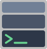

<p align="center">
  
</p>

# TermStack

## Overview

TermStack keeps the traditional terminal workflow while adding support for full graphical applications. This is implemented by treating the output of every terminal command as its own window and stacking these windows inside a one-column tiling window manager. TermStack runs in a nested wayland session, so that all the components together behave like a normal terminal emulator in most ways.

### Key Features

- **Content-aware sizing**: Terminal windows grow as they produce output
- **Scrollable column**: All windows stack vertically and can be scrolled
- **Auto-scroll**: Automatically scrolls to keep the active terminal visible

## Current State

This is an LLM generated proof-of-concept. The focus is not on getting the best implementation, but to figure out the user experience and test the general desirability of this concept.

## Architecture

```
termstack/
├── crates/
│   ├── compositor/     # Smithay-based Wayland compositor (library)
│   ├── termstack/      # Unified binary (compositor + CLI)
│   ├── terminal/       # Terminal emulation using alacritty_terminal
│   └── test-harness/   # Testing infrastructure with tests/ subdirectory
└── scripts/
    └── integration.fish # Fish shell integration
```

**Note:** The `termstack` binary uses smart mode detection. When run directly, it starts the compositor. When run inside a termstack session (TERMSTACK_SOCKET is set), it acts as the CLI tool for spawning new terminals.

### Tech Stack

- **Compositor**: [Smithay](https://github.com/Smithay/smithay) - Rust Wayland compositor library
- **Terminal**: [alacritty_terminal](https://github.com/alacritty/alacritty) - Terminal emulation
- **Rendering**: fontdue (font rendering) + softbuffer (pixel buffer)
- **Testing**: proptest (property-based testing)

## Building

### Dependencies

**System packages** (Debian/Ubuntu):
```bash
sudo apt install \
    libwayland-dev \
    libxkbcommon-dev \
    libudev-dev \
    libinput-dev \
    libgbm-dev \
    libdrm-dev \
    libseat-dev
```

**Runtime dependencies for X11 support** (optional but recommended):

```bash
# Quick install - run the setup script (handles everything automatically)
./install-deps.sh

# Or manually install xwayland-satellite:
# 1. Install system libraries
sudo apt install libxcb-cursor-dev libxcb-render0-dev libxcb-shape0-dev libxcb-xfixes0-dev

# 2. Install xwayland-satellite from GitHub
cargo install --git https://github.com/Supreeeme/xwayland-satellite.git xwayland-satellite
```

> **Note**: xwayland-satellite is required for X11 application support (e.g., mupdf, xeyes). The compositor will work without it in Wayland-only mode.

### Build

```bash
# Build all binaries
cargo build --release

# Or build the main binary
cargo build --release --bin termstack
```

## Running

```bash
# Start the compositor (opens in a winit window for development)
cargo run --release --bin termstack

# Or run on real hardware (requires seat access)
SMITHAY_BACKEND=udev cargo run --release --bin termstack
```

## Key Bindings

All bindings support both Super and Ctrl+Shift modifiers (Ctrl+Shift works when running nested under another compositor).

| Key | Action |
|-----|--------|
| Super+Q / Ctrl+Shift+Q | Quit compositor |
| Super+T / Ctrl+Shift+T | Spawn new terminal |
| Super+Return / Ctrl+Shift+Return | Spawn new terminal |
| Super+J / Ctrl+Shift+J | Focus next window |
| Super+K / Ctrl+Shift+K | Focus previous window |
| Ctrl+Shift+Down | Focus next window |
| Ctrl+Shift+Up | Focus previous window |
| Ctrl+Shift+C | Copy selection |
| Ctrl+Shift+V | Paste from clipboard |
| Super+Down | Scroll down |
| Super+Up | Scroll up |
| Super+Home | Scroll to top |
| Super+End | Scroll to bottom |
| Page Up / Ctrl+Shift+Page Up | Scroll up one page |
| Page Down / Ctrl+Shift+Page Down | Scroll down one page |

### Fish Shell Integration

The built-in integration enables automatic command routing:
- **Regular commands** spawn in new terminals above the current one
- **Shell builtins** run in the current shell
- **GUI apps** (via `gui` command) get an output terminal when they produce stderr

### Configuration

Optional: Create `~/.config/termstack/config.toml`:

```toml
# Color theme
theme = "dark"  # or "light"

# Window settings
window_gap = 0
min_window_height = 50
scroll_speed = 1.0
auto_scroll = true

# Apps that use client-side decorations (skip compositor title bar)
csd_apps = ["firefox", "org.gnome.*"]
```

## Testing

```bash
# Run all tests
cargo test

# Run specific test file
cargo test --test window_positioning
cargo test --test layout_properties

# Run with nextest (faster)
cargo nextest run
```

## Design Decisions

### Explicit State Machine

The terminal sizing uses an explicit state machine to prevent the content-counting bugs from v1:

```rust
enum TerminalSizingState {
    Stable { rows, content_rows },
    GrowthRequested { current_rows, target_rows, content_rows, pending_scrollback },
    Resizing { from_rows, to_rows, content_rows, pending_scrollback },
}
```

Content rows only increment in the `Stable` state. Lines that arrive during resize are tracked in `pending_scrollback` and restored after the resize completes.

### Pure Layout Calculation

The layout algorithm is a pure function with no side effects:

```rust
impl ColumnLayout {
    pub fn calculate(windows: &[WindowEntry], output_height: u32, scroll_offset: f64) -> Self;
}
```

This makes the layout testable and predictable.

## License

MIT
